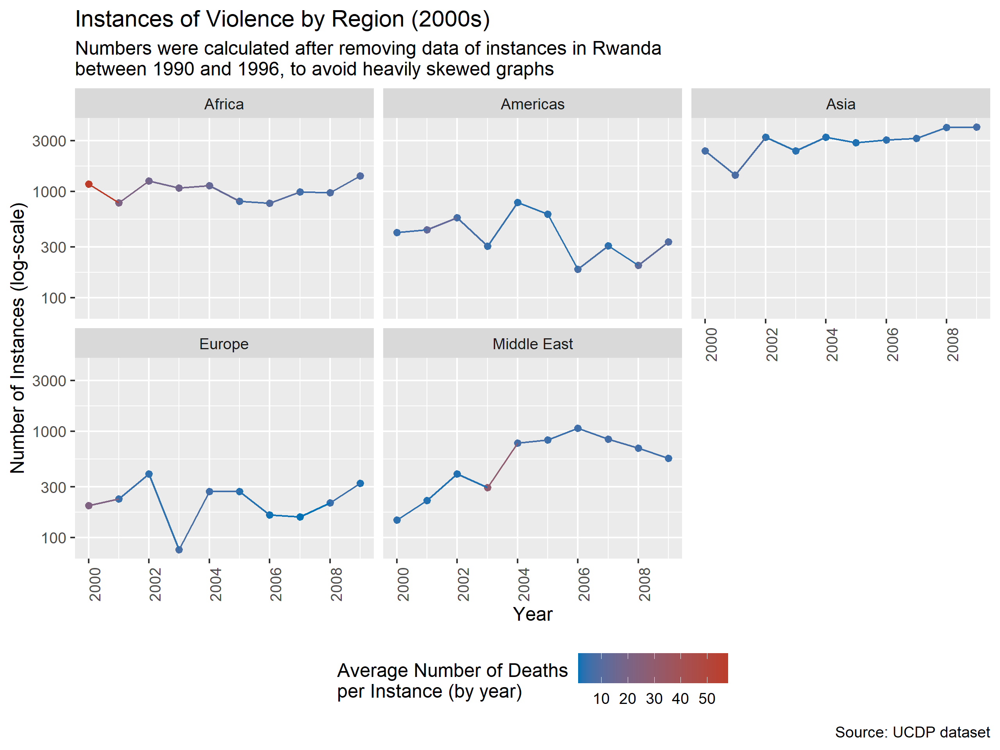
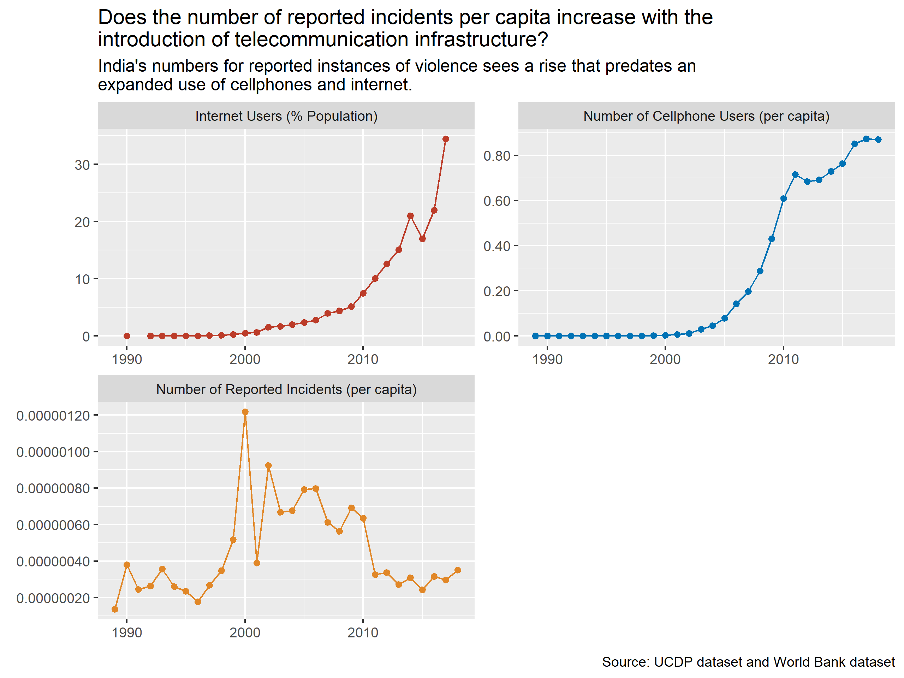
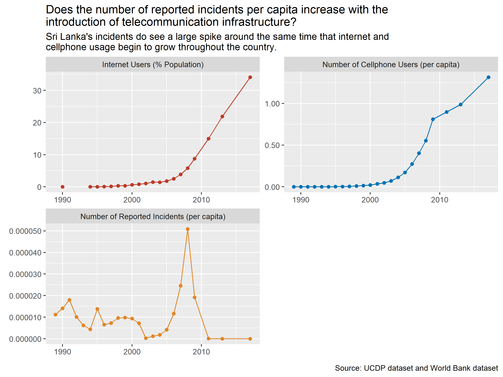
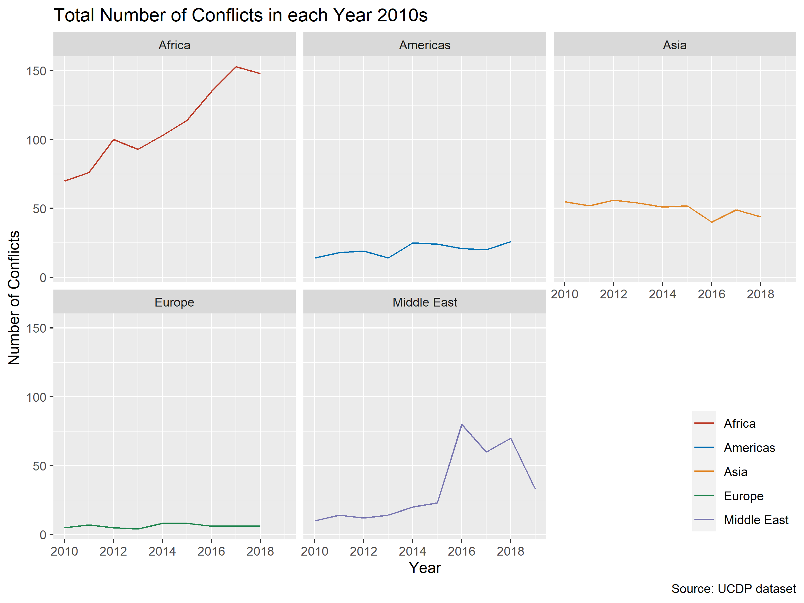

```{r, include=FALSE}
unlink("Plots", recursive = TRUE)
unlink("Results", recursive = TRUE)
```

```{r, include=FALSE}
source("Scripts/fp_libraries.R")
source("Scripts/fp_define_functions.R")
source("Scripts/fp_create_subdirectories.R")
source("Scripts/fp_generate_data.R")
source("Scripts/fp_transform_data.R")
source("Scripts/q1h1.R")
source("Scripts/q1h2.R")
source("Scripts/q2h1.R")
source("Scripts/q3h1.R")
source("Scripts/q4h1.R")
source("Scripts/china.R")
```

# Introduction

This project focuses on violent conflict throughout the world.  Within the last 30 years, we've seen a number of major conflicts (e.g. the Gulf War, the Rwandan Genocide) as well as sustained asymmetric violence (e.g. a rise in international terrorism, the War on Drugs and the collateral damage from that).  However, with our general awareness of this violence comes some assumptions; mainly, that the world seems to be a much more violent place.  We decided to ask some questions and make some initial hypotheses to test these assumptions.  Do note that while we had already found our dataset, we had brainstormed our questions and hypotheses before getting a detailed look at our data.

To that end, we chose to investigate data collected by the Uppsala Conflict Data Program (UCDP), run out of the University of Uppsala in Sweden.  While they have multiple datasets that span all the way back to 1946, we chose to utilize their Georeferenced Event Dataset (GED) version 19.1 (as well as integrating their Syria-specific dataset).  This dataset provides records sourced from news-wire and other local news agencies around the world that include the perpetrator and victim(s) of violent acts, locational data (including latitude and longitude of the nearest reliably referenced location where the violence occurred), the start and end date of the event, the source article and publisher, and low, high, and best estimates for the number of deaths from the event (among other variables provided, 50 in total).  From this dataset, we hope to look at trends in various regions of the world for violence perpetrated by and against different groups of peoples.

For a second level of analysis we downloaded some datasets from the World Bank Databank pertaining to cellphone and internet users in a given country, as well as national population estimates.  These datasets were merged with our main UCDP data using `dplyr` joins by the `year` and `country_id` variables (there was admittedly some data loss as resulting from the join, but most of the failures for converting country code types accounted for small island nations in the Caribbean and the south Pacific, which don't appear often in our UCDP data).  One major case of data loss (which is discussed later) stems from the lack of recent data from the World Bank concerning Syria.  As stated above, our team proceeded to come up with questions and hypotheses we thought we could use this data to answer.

# Initial hypotheses

## Question 1: "What kinds of conflicts have become more prevalent worldwide in the past three decades?"

As stated above, we believe that there is a general sense that today's world is a more violent place.  We're not sure if this is just a learned assumption conditioned into us by sensationalized news stories, or if it's true.  Our first question asks what kinds of conflicts have become more prevalent in the last three decades.  Specifically, we wanted to differentiate between violence perpetrated by government forces (whether against other governments or non-state actors), and violence conducted by non-state actors.  Below is our initial hypothesis.

### Hypothesis 1: "There has been a reduction in violence perpetrated by government forces, but an increase in violent conflicts by and between non-state actors in recent years."

To investigate this, we needed to classify the events in our data by who the perpetrator was.  We then wanted to count the total number of reports in the dataset for each year, and visualize who the aggressor was.  We created a binary variable which separates the data into two groups: those events where the aggressor was government forces, and those which the aggressor was specifically non-government (it doesn't matter if they were working in conjunction with government forces over the course of the whole conflict, since we are looking at the data at the level of individual instances of violence).


This graph gives us a startling picture.  Over the last thirty-one years, there has been a rise in reported instances of violence, with an incredible spike in the last five years (the drop-off in 2018 onward is discussed later).  This immediate picture shows that the first half of our hypothesis is unlikely to be true; government-based violence has been on the rise, not a decline.

Another noticeable trend has been the increase in non-state violence in the last few years as well.  To see this trend in a different way, we plotted a proportion graph of the same binary variable.


As this plot shows, there has been a shift to a higher proportion of non-state actors accounting for violent acts in the last five years.  This also give us a clear visual that governments still perpetrate the vast majority of violent acts.  Now that we have an idea of a worldwide trend, let's see if any interesting trends pop up when we look at the various regions of the world.

For this section, rather than looking at just government vice non-state actors as the perpetrator, we wanted to further classify based on both aggressor and victim.  This can provide a visual context for inter-state conflicts (i.e. government forces attacking other government forces) in different parts of the world.  We `mutate` a new variable that codes for three levels: government vs government forces, government vs non-government forces, and non-state based violence.

#### Africa


It seems that Africa had a tumultuous period in the 1990s.  This period included one of the most famous conflict events: the Rwandan Genocide (how this affected our data will be discussed later).  In the 2000s, it seems as if violence, while still present, seemed to almost stabilize; meaning, there was not as many peaks and valleys across the different aggressor/victim types.  Unfortunately, the 2010s do see sharp increases in both government vs non-government violence, and non-state actor based violence.  Across the whole dataset , government vs government violence looks oddly low.  However, if you think about it, a rebel group is considered a non-state actor during a conflict; if the group succeeds in a coup, they only become "government forces" after the fact.  This is demonstrated by the AFDL and the creation of the Democratic Republic of the Congo in the 1990s (see hypothesis 2).

#### The Americas


Two trends that are quite clear across the decades in the Americas is a decline in government based violence and an increase in non-state actor violence.  The spike in government action in the 2000s represents a period of terrible conflict between the Government of Colombia and the FARC rebels.  The upward trend in non-state actor violence is discussed further in our second question.  The profile of violence in the Americas does seem to match our initial hypothesis: a decline in state-sponsored violence with an increase in non-state actor based violence.

#### Asia


Two notable points from this graph is the definite increase in government action over the last three decades, and the continual presence of government vs government action.  One thing to note about our methodology is that government action within a region does not have to be perpetrated by a government of a country within that region.  For example, increased government vs non-state violence in Asia does include U.S. forces fighting against Taliban and al-Qaeda forces.  The War on Terror could certainly account for the increase in reported instances in Asia.  Asia, unlike in the Americas, seems to see a trend directly opposite from our hypothesis: state-sponsored violence has been on a steady rise, while non-state violence has declined in the last decade after a peak in the 2000s.

#### Europe


Note that this graph does not depict any instances of government vs government violence.  Europe in the 1990s saw a number of violent conflicts, including the First Chechen War from 1994 to 1996.  Aside from that spike, there's been a relative decline in instances of violence, and the numbers are much smaller in general than the other regions.  One other item of interest is the islands of relative increase in average fatalities.  They don't seem to follow any sort of trend, possibly indicating that they are localized on particular violent conflicts.

#### The Middle East


This graph is quite striking.  The sheer magnitude of the spike in the 2010s is stark in itself.  Of particular note is the spike in non-state actor violence.  This may account for the jump in recent years in our proportion plot.  Looking at the average fatalities in the government vs government data, we can most likely attribute these spikes to the major conflicts in the region within the time frame of our dataset, namely the Gulf War and the invasion of Iraq after 9/11.

To further explore the role of non-state actors in our data, we decided to drill down on the most violent players in each of the decades.

### Drill Down: Who are the deadliest non-state actors in each decade?

From our original dataset, we can find out which non-state group claimed the highest number of victims in each decade, which would yield the following table:


While we didn't group by region for this finding, it is quite telling that for both the 1990s and the 2000s, the deadliest groups in the world were both active in central Africa.  Let's take a look at each one.

#### The Alliance of Democratic Forces for the Liberation of Congo-Zaire (AFDL)


The deadliest non-state group in the 1990s was The Alliance of Democratic Forces for the Liberation of Congo-Zaire, or the AFDL.  The Rwandan Genocide had left the eastern part of then- Zaire destabilized, and the AFDL successfully defeated the government to form the Democratic Republic of the Congo after the First Congo War.  Much of the conflict along the borders of Uganda, Rwanda, and Burundi reflect the violence in this period.  

#### The Lord's Resistance Army (LRA)


In the 2000s, the Lord's Resistance Army (LRA) had massive amounts of conflict in central Africa. Led by Joseph Kony, they had not only abducted an estimated 25,000 children to act as child soldiers, but are responsible for thousands of deaths in southern Sudan, northern Uganda, and the DRC, as well as the displacement of hundreds of thousands of Congolese.

#### Islamic State (IS)


In the 2010s, the Islamic State (IS) has clearly taken over as the most violent group.  What is distinct about IS's actions is their global reach.  As opposed to the first two non-state actors, IS is shown to have a much further reach.  It is not isolated to a particular country or region.  The difficulty in combating international terrorist organizations in particular partially comes from their lack of specific geo-political goals.  The ADFL and LRA were tied to geopolitical and ethnic feuds, and thus localized to where the affected populations exist.  IS's jihad against western normative culture allows them free reign to target any particular place or peoples that draw their ire.  Additionally, splintering and factioning within IS, as well as cross-group support, can create multiple "fronts", as can be seen in the worldwide map.  Let's take a look at their actions specifically in the Middle East.


As we can see, there is a heavy concentration in Syria and northern Iraq.  With the Syrian Civil War ongoing, the instability in the country made it a perfect environment for extremist ideologues to gain a foothold.  In the future it would interesting to graph a fine detail time series on IS's violent acts, but for now we can see by the sheer number of instances that IS has dominated the last decade as the non-state group responsible for the most instances of violence.

In summary, our initial hypothesis was mostly incorrect.  The perception that state-based violence has gone down is probably due to the lack of "traditional" wars in recent years.  There are always hotspots that crop up: India-Pakistan border disputes, North Korea/South Korea shelling across the DMZ.  But state-sponsored violence has been on the rise.  Another explanation is the bias against one's own country.  An American may not view U.S. military action against terrorists as instances of violence, but that doesn't mean that those events shouldn't be counted.  The second half of the initial hypothesis does have some merit.  Relative to previous decades, the 2010s did see a surge in instances of violence by non-state actors (both in sheer number of instances and in proportion of total instances).  The rise of international terrorism adds a particularly worrying dimension to it by making it borderless, or rather delocalized.

### Hypothesis 2: "Violent conflict has risen in frequency over the last decade, but overall is lower than in previous decades"

Our second hypothesis is posed as a sort of alternative of our first; it's a prediction that the last decade has seen a rise in instances of violence, **but** has less conflict than in previous decades.  Again, we are looking at instances of violence (i.e. number of observations in our dataset) by year.  As always, we want to start by looking at a world overview.


Already, we can see that our hypothesis is incorrect.  We were right in thinking that violence has increased in the last decade, but it is far and away higher than in previous decades.  This plot does have some interesting implications though.  Two initial thoughts are raised about validity.  First, at the far right of the graph we see the tremendous drop for 2019 (which follows smaller drops after a peak in 2016).  The drops from 2016 to 2017 and 2017 to 2018 are themselves not too incredible to be believed, but 2019 clearly is not accurate.  Before looking at this further, it's best to investigate each decade in detail.





These plots show that Europe and the Americas have seen an overall decrease across decades, while all other regions have seen a steady increase across our dataset.  Of particular interest is the spike in the Middle East.  Again, we want to take a look at the validity of our dataset.  If you look closely, one notices that for the 2010s, only one region (the Middle East) has a data point in 2019.  All other regions' data ends in 2018.  This in itself is enough to tell us that the data for 2019 is incomplete.  Let's take a look at another graph to check our suspicion:


With the added loess (locally estimated scatter plot smoothing) line, we see that our 2019 data is certainly outside what we would expect it to be.

Looking back at the codebook provided by UCDP, we note that their process for collecting data has multiple steps, included automated collection, human-driven data validation, as well as secondary human-driven data collection from local news sources; this last step also includes language translation, which is a time- and labor-intensive process.  It only makes sense that there would be a lag in reporting, as there is for a lot of datasets that are built on collection from disparate sources.  Future iterations of this dataset are sure to include more data.

To our second question about validity of this methodology (looking at trends in number of instances), we may ask the question: how much of the observed upward trends is due to an actual increase in violent acts, and how much could be accounted for by better reporting?  The world of telecommunication today is a far cry from what it was in 1989.  The spread of internet and mobile telecomm (i.e. cellphones) may play a large role in how conflict data is being reported on and collected.  Let's bring in some World Bank Development Index data on cellphone and internet usage.

### Drill-down: Is there a correlation between telecommunication development and reported violence?

For a closer look at the data, we wanted to identify the countries with the highest number of reported cases in a given year.  The following table shows the top twenty country-years for reported instances of violence.


Within this table there are five countries across the top twenty entries: Syria, Afghanistan, Nepal, India, and Sri Lanka.  Unfortunately, the World Bank didn't have updated data on Syria for these indices, so we had to look at the other four countries.  The following are visualizations for a countries number of reported instances of violence (per capita, calculated with World Bank population estimates), its cell phone users by year (also per capita), and its number of internet subscribers (as a percentage of population).

#### Afghanistan


This graph seems to show a correlation between number of reports and the increased use of telecomm in the country.  However, these might be have a confounding variable: the War on Terror.  An increase in violence in Afghanistan can be attributed to the post-9/11 surge in military action by coalition forces.  Those coalition forces also initiated nation-building efforts, which I'm sure involved developing better telecommunication infrastructure throughout the country.  So these indices could be related but not in a causal fashion.

#### India



India's violence graph, conversely, doesn't see as strong correlation between violence and telecomm.  One contributing factor in this, I believe, is the sheer size of India, both in area and in population.  India's history also lends itself to bucking the trend among the five countries we're looking at; as a former British colony, there's a good chance that in more developed parts of the country there already exists communication infrastructure necessary to report violence by more traditional means (i.e. local news reports and news-wire for major events).  Additionally, the size of the population affects the scale of per capita graphs by an order of magnitude.  In this way, dramatic shifts in the graph are an over-representation of movement that is in reality smaller than shown.  A further drill down in granularity may help clarify (e.g. looking at state-level data for India, instead of country-wide).

#### Nepal


This graph is quite striking.  There again seems to be a correlation between telecomm and reporting of violence.  The spike in the violence curve is representative of the collapse of peace talks during the Nepalese Civil War in 2002, with increased violence between the Government of Nepal and the Maoist rebels.  However, the mountainous nature of the country could still lend credence to the correlation; would some of the reports of violence by the Maoists in rural parts of the country have been reported otherwise?  Further research into this topic would certainly help.

#### Sri Lanka



This graph is somewhere between India's graph and Nepal's graph.  There are significant counts of violence before the increases in telecommunication, but there also exists the spike in violence between 2005 and 2009.  This time frame is reflective of the fourth phase of violence between the Sri Lankan government and the Liberation Tigers of Tamil Eelam (LTTE), during the Sri Lankan Civil War, also known as the Sixth Eelam War.

Does this mean that our drill down question is invalid?  Each of the spikes in violence in these graphs (that have them; India excluded) happens to represent major conflicts, either civil wars or the war on terror.  Do these just happen to line up with the increase in telecomm usage in the countries?  Our first look at this subject has yielded some interesting results, but does leave additional questions to be answered upon further investigation.

## Question 2: "Is violent conflict becoming more deadly or less deadly over the years? Are there any exceptions to these trends?"

From our first question, we have seen that instances of violence have been increasing worldwide (whether as a function of better reporting or not is unclear).  However, has that violence been more deadly as well as more frequent?  Our initial hypothesis is as follows:

### Hypothesis: "Although violent conflict has been on the rise globally in the past decade, average fatalities are likely to be lower than conflicts in previous decades."

First, let's look at the total number of fatalities (from the best estimate variable in our dataset) per year and region.


In four of the five regions, we see an increase in yearly number of deaths.  Only Europe has seen a downward trend in the last decade.  One item of note is the spike in the Americas in 2018.  Could the region be trending up again, and what could be causing this?

Next, we'll look at the average fatalities per instance per year.


Europe and the Americas are quite low relative to the other regions, while the Middle East and Asia have both seen an increase in mean fatalities in the last decade.  Interestingly, Africa actually saw a decline from the peaks seen in the late 1990s and early 2000s.  One obvious possible reason for this is the extremely high numbers from the Rwandan Genocide skewing the average numbers up.  In the Middle East, there is a clear dramatic spike in 2016, while Asia has seen a more steady upward trend over the last ten years.

To try to account for skewing by outliers, let's look at the same data by median deaths rather than average fatalities:


The median plot in Africa doesn't have as dramatic of peaks in the 1990s, but they are still visible.  Additionally, the median deaths in Africa have crept higher in the last decade than the mean fatalities.  In Asia, the median plot is even more striking.  Aggregating both metrics, the deadliness of conflicts have gone up at a regional scale.  To look at the national level, we have to take a look at the distribution of national mean and median deaths over the years by region (as well as log-scale graphs for outlier normalization).


In general we see downward trends in the distribution of national means and medians.  When we consider this alongside our observation of a rise in total number of fatalities in most of the regions, we have to conclude that there must be significant conflicts that are producing large numbers of deaths to account for the rise in totals.  The upward trend in mean and median deaths in Asia draws our attention.  In the same way as above, we wanted to take a closer look at the national distribution within Asia for mean and median deaths to see if we can extract validation for our analysis.


This graph shows us that, although our initial graphs showed that fatalities are on the rise, the average deaths per event (aggregated at a national level) has dropped, lending credence to our hypothesis.  The spread in Asia in this distribution is much narrower in the 2010s than it was in the 1990s, (mostly) averaging fewer than 20 deaths per event.  Still, we have to account for the rise in total, mean, and median deaths in Asia.  Let's drill down.

### Drill-down: Who is responsible for the rise in total, mean, and median deaths in Asia in the 2010s?

In order to do this, we wanted to identify the events that produced the highest death (estimate) counts to help us identify the dyads that are possibly responsible for the rise in fatalities.


As might be predicted, violence in Afghanistan has been rather deadly, with the deadliest event estimated to have nearly 1,900 victims.  Violence connected to the Taliban accounts for over 25,000 entries in our dataset of about 170,000 entries (this is nearly 15%).  Below are some of the top deadliest events involving the Taliban (nearly identical to the table from all of Asia).


To cast a comparison, let's look at a similar density plot for numbers of deaths per entry across the years, looking at total deaths for Taliban related events against the means and medians for events in Asia:

 

Since we can see that the Taliban related events have increased in deadliness (as indicated by the upward spread in the densities) vice the means and medians in Asia, we can see that these Taliban related violent acts have contributed significantly to the rise that we see in the regional totals in Asia over the last decade.  The tables show us that the Taliban related events are not only some of the deadliest in Asia (with two over 1,500 victims), but constitute the outliers that would bring the total death counts much higher than the density plots would have us otherwise believe. 

In this way, our hypothesis has some merit, as long as we qualify our response to include specific major conflicts that can bring regional totals up, even as national means and medians within each region is trending down.

## Question 3: "Which regions have seen the highest growth in number of violent conflicts in recent years? Have any regions seen a reduction in conflict?"

In our previous two questions we looked at numbers of instances of violence (i.e. observations in our dataset), and number of fatalities (i.e. the `best` variable from our dataset).  In this question, we specifically wanted to look at total conflicts, meaning numbers of pairings of identifiable groups (i.e. the `conflict_new_id` in our dataset).  We want to look across the regions to see which way each is trending.  Will this match up with our previous analyses?

### Hypothesis: "There is likely to be a noticeable increase in number of conflicts in the Middle East and Africa. Regions in the Americas and Asia may have seen a relative reduction in conflict in the past decade."

Again, our hypothesis was formed mostly from general perceptions and assumptions about global conflict.  With so much news coverage in the past decade of the War on Terror, we assume the Middle East and Africa will have an increase in conflicts, while other regions may have a relative reduction in number of conflicts.  As always, we started with an overview of global numbers:


This plot mirrors our total instances and fatalities, though most closely in the spike in the last decade.  The number of conflicts shows a much flatter trend between the 1990s and 2000s.  From 2010 onward, we have only seen one dip, otherwise the trend has been up.  2019, as accounted for already, is probably incomplete at the time of publishing of this iteration of the dataset.  What will the regional data look like for conflict numbers?


As predicted by our hypothesis, the Middle East and Africa have observed an upward trend in number of conflicts, and Asia and Europe have seen a slight decrease in the last ten years.  In our hypothesis we referenced Latin America.  If we take this to mean countries where Spanish, Portuguese, and French are primary languages, we can conclude that our datasets `Americas` region is analogous for Latin America (Canada and the United States account for a *total* of 40 entries in the dataset of about 170,000).  That being said, the last ten years have seen a slight increase in the number of conflicts seen in the Americas (further discussion will take place in our last question).




Further investigation by region and decade doesn't yield additional insight other than the apparent rise in the initial region graph is a result of the log-scale applied to the Y-axis.  Our hypothesis remains intact, though further analysis is warranted to see if the trends for number of conflicts and numbers of instances or deaths diverge at a more granular level.

## Question 4: "In the regions with the highest growth rate in violent conflict, which conflict type has seen the greatest increase in the past decade?"

In our final question, we wanted to investigate type of violence.  Our dataset defines three types of violence: state-based, non-state based, and one-sided violence.  We have previously discussed state vs non-state violence when it comes to the aggressor, and the codebook defines one-sided violence as any action against non-combatants (labeled as "Civilians" in the `side_b` variable).  In forming our hypothesis, we are primarily interested in non-state violence.

### Hypothesis: "It is likely that non-state actor conflict is likely to be a major contributor to overall growth rates in violent conflicts."

To test this hypothesis, we want to see if there are any trends in the different types of conflicts:


Having discussed trends in Africa and the Middle East, let's take a closer look at the Americas.  This region stands out in this graph because the non-state conflicts show a steady rise (evident in the blue bars).  The increases in the Middle East and Africa are also apparent, but in those regions, instances of violence as a whole are on the rise.  Line graphs help differentiate the trends for each type of violence:


Taking a look at the Americas graph, we can definitely see a major shift in type of violence, where in Africa and the Middle East, the rise in each type of violence seems to be proportional (even if to a great magnitude as in the Middle East). This plot confirms our assessment.  Isolating the non-state conflict data yields the following graph:


Again, the counts of instances of violence have increased for non-state based violence in the Americas, Africa, and the Middle East.  To see how this trends for fatalities, we can graph total fatalities by region and type of conflict:


The Americas is distinct from the other two regions in that since 2007, non-state based violence accounts for nearly all of the deaths in the region:


Outside of the Americas and the Middle East, non-state based violence has not increased in its proportion accounting for deaths globally.  So while our initial hypothesis could be correct, it would be wrong to say that non-state action was a **major** contributor to the increase in total deaths.  As stated above, the Americas take a drastic departure from other regions in its proportion of deaths from non-state action.  Let's drill down on it.

#### Drill-down: What has caused such an increase in non-state based violence and deaths in the Americas in the 2010s?

In order to find out what is responsible for the increase, we wanted to look at how many fatalities per year can be attributed to which dyad pairs.  When we look at the following table, we can see there is a large number of drug cartels involved in the deadliest years.


In order to get a closer look at the relevant data, we wanted to create a subset of data that attempts to extract observations specifically related to drugs.  Using regular expressions and `str_detect`, we drilled down and produced about 2,700 cartel related observations (in the Americas in 2010s), with about 1,600 that are specifically drug related (while the regex was crafted as carefully as possible, it is a) not comprehensive and may have missed some cartel related cases and b) any attempts to widen the regex had deminishing returns by capturing non-cartel related murders, insurgencies, etc that fell outside of what we wanted to look at).


This graph shows that from within those 2,700 observations, there has been an upward trend in the last ten years with drug related violence.  Looking at our subset of data, almost all of the violence takes place in Mexico.


While the violence is quite dispersed throughout the country, we can see that there is still considerable violence that occurs along the U.S.-Mexico border.  We can hypothesize that cartels might fight each other over control of these illicit smuggling channels.  They may also have no issue with perpetrating violence against any local authorities that try to stand in their way.

Again we wanted to highlight that our regex methodology is rather basic, and we can't say that the graphs are conclusive.  But they did provide a potential glimpse as the state of violence in the Americas for the last decade.

In all, our initial hypothesis has to be moderated; worldwide, non-state violence hasn't *greatly* increased the fatalities in a given year.  We can say this is true specifically about the Americas, mainly due to cartel violence.

# Final Thoughts

Conflict studies is incredibly complex.  There are so many factors to consider when making any sort of assumptions or hypotheses about specific topics or regions.  The UCDP dataset is remarkably robust, though it falls a bit flat for near-term analysis, given the lag in reporting.  It also allows us to check our own assumptions about the state of violence in the world.  Media has a tendency to focus on certain topics for a time, but the public attention span seems to fall off quickly as news coverage decreases.  With this constant cycling, it's easy to imagine that the general population may have some incorrect perceptions of conflicts around the world.

# References

Uppsala Conflict Data Program (UCDP):
[https://ucdp.uu.se/](https://ucdp.uu.se/)

Sundberg, Ralph, and Erik Melander, 2013, “Introducing the UCDP Georeferenced Event Dataset”, Journal of Peace Research, vol.50, no.4, 523-532

Högbladh Stina, 2019, “UCDP GED Codebook version 19.1”, Department of Peace and Conflict Research, Uppsala University

World Bank Databank:

[Individuals using the Internet (% of population)](https://data.worldbank.org/indicator/IT.NET.USER.ZS?view=chart)

[Mobile Cellular Subscriptions](https://data.worldbank.org/indicator/IT.CEL.SETS?view=chart)

[Population, total](https://data.worldbank.org/indicator/SP.POP.TOTL?view=chart)

[GINI index (World Bank Estimates)](https://data.worldbank.org/indicator/SI.POV.GINI?view=chart)

[GPD per capita (constant 2010 US$)](https://data.worldbank.org/indicator/NY.GDP.PCAP.KD?view=chart)

Coding references:

[Mapping Data](https://www.r-spatial.org/r/2018/10/25/ggplot2-sf.html)

[Graphics Design](https://www.r-graph-gallery.com/index.html)

[Matching WB and UCDP country codes](https://stats.andrewheiss.com/donors-ngo-restrictions/01_get-merge-data.html#conflict),  [coding](https://cran.r-project.org/web/packages/countrycode/countrycode.pdf)

# Session Info

```{r}
sessionInfo()
```

